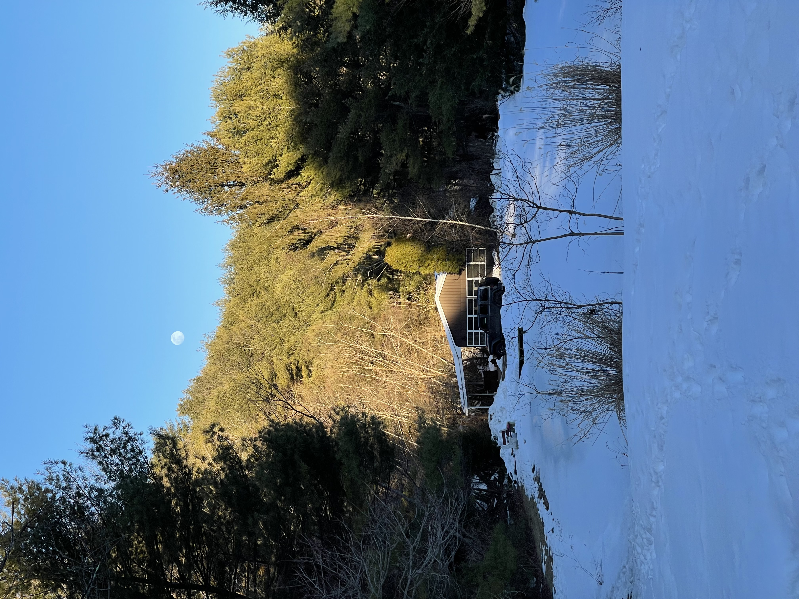

# Falling Leaves

We bought Falling Leaves in December of 2020, in the midst of the COVID-19 pandemic. It sits on ~15 acres in the Poconos and is as close to "off-grid" as you can get while still definitely remaining _on the grid_. 

Nestled in the valley between two foothills, it is most impressive at sunset. 

It has a one-acre pond which we intend to stock with fish \(not for fishing\) and several distinct groves of woods. My favorite is the white spruce. 

